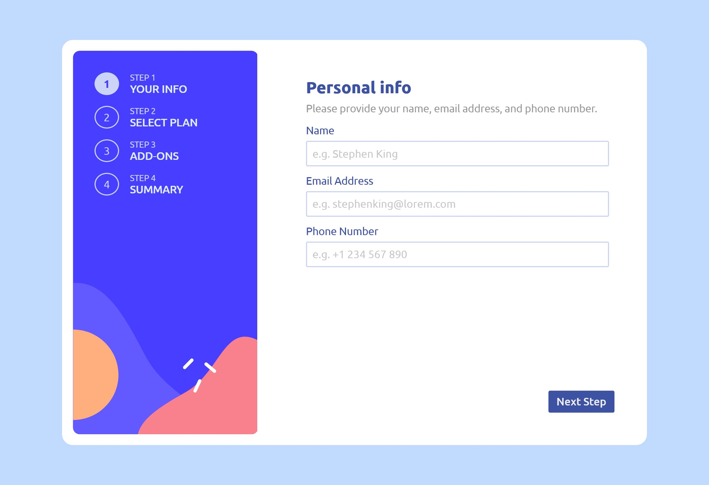
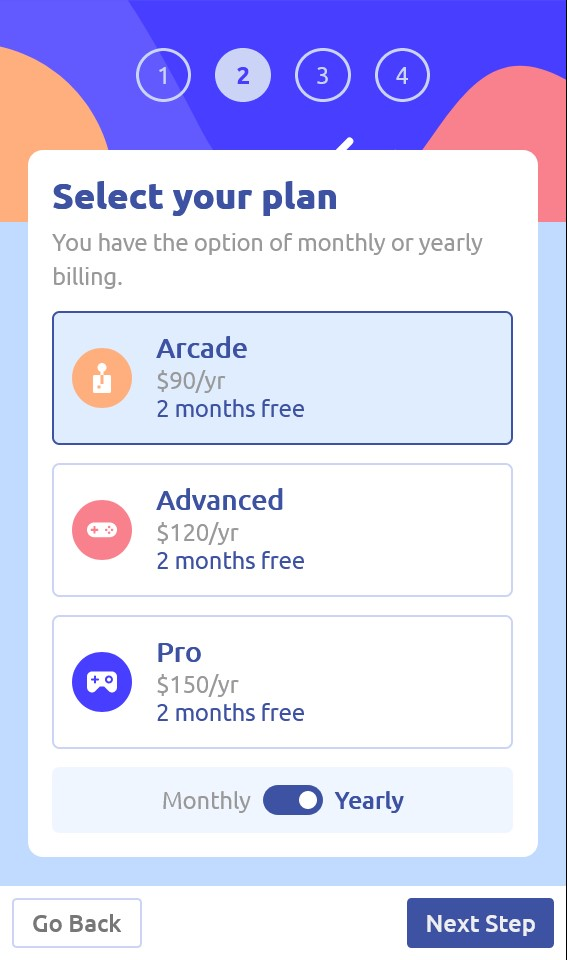
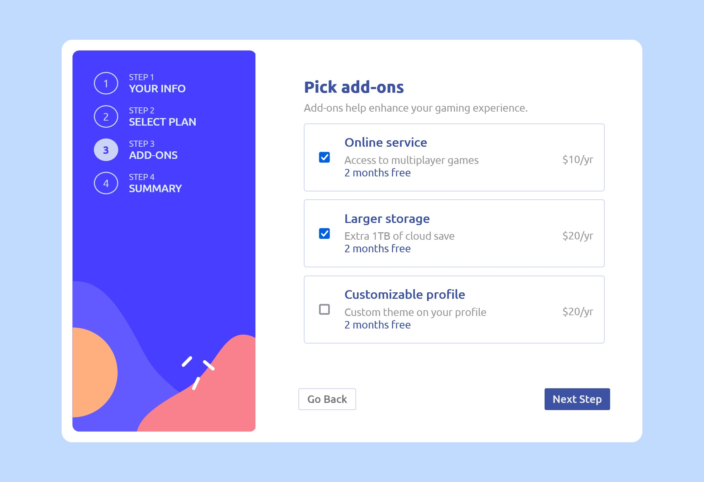
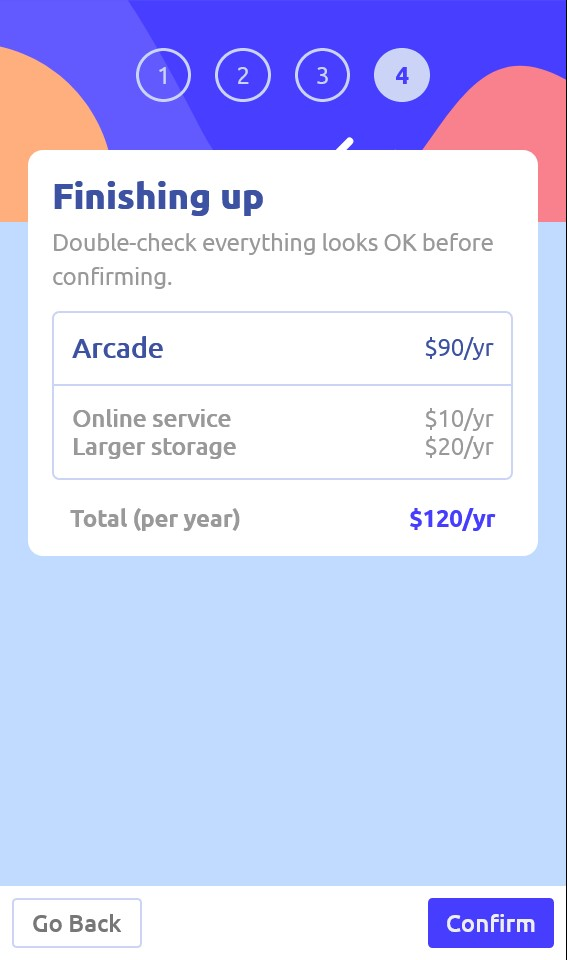

# Frontend Mentor - Multi-step form solution

This is a solution to the [Multi-step form challenge on Frontend Mentor](https://www.frontendmentor.io/challenges/multistep-form-YVAnSdqQBJ). Frontend Mentor challenges help you improve your coding skills by building realistic projects.

## Table of contents

- [Overview](#overview)
  - [The challenge](#the-challenge)
  - [Screenshot](#screenshot)
  - [Links](#links)
- [My process](#my-process)
  - [Built with](#built-with)
  - [What I learned](#what-i-learned)
  - [Continued development](#continued-development)
  - [Useful resources](#useful-resources)
- [Author](#author)

## Overview

### The challenge

Users should be able to:

- Complete each step of the sequence
- See a summary of their selections on the final step and confirm their order
- View the optimal layout for the interface depending on their device's screen size

### Screenshots






### Links

- Personal Portfolio - [Jhon Asay](https://www.jhonasay.com)
- Live Site URL: [https://ja-multi-step-form.netlify.app](https://ja-multi-step-form.netlify.app/)

## My process

### Built with

- Semantic HTML5 markup
- Sass custom properties
- Flexbox
- Mobile-first workflow
- Vanilla JavaScript ES6

### What I learned

This challenge was great because it had a lot of dynamic components that I had to figure out how to do. My problem solving skills were sharpened as I had to plan for the user's experience and interactions, making sure that every component worked as intended.

I learned how to record the user's data as the user progressed through the form by making functions that kept updating a UserInfo object in real time. I would later retrieve this data to confirm the user's choices in the final page of the form.

I learned that in CSS you can still use input functions even if they are hidden from the user. One example of this is for the user's plan choice, the radio buttons are hidden, however, the user is able to make his selection by clicking on the entire stylized label. Another example is when I used a checkbox input for the user's billing-term-toggle button. I hid the button and instead inserted an element ::before and ::after the "Yearly" span and styled it to look like a pill toggle button. See the code snippet below if you would like to try this yourself:

```html
<label class="toggle__label" for="toggle">
  <span class="monthly selected">Monthly</span>
  <input
    class="toggle"
    type="checkbox"
    id="toggle"
    name="toggle"
    value="pricing"
  />
  <span class="yearly">Yearly</span>
</label>
```

```css
.toggle {
  opacity: 0;
  visibility: hidden;
  position: absolute;
}

.toggle + .yearly {
  position: relative;
  display: flex;
  align-items: center;
  gap: 1rem;
}

/* This is the pill background */
.toggle + .yearly::before {
  content: "";
  width: 5rem;
  height: 2.5rem;
  background-color: var(--color-primary);
  border-radius: 20px;
}

/* This is the switch that slides left and right */
.toggle + .yearly::after {
  position: absolute;
  content: "";
  left: 0.5rem;
  width: 1.5rem;
  height: 1.5rem;
  background-color: #fff;
  border-radius: 10px;
  transition: all 0.3s ease-out;
}

.toggle:checked + .yearly::after {
  transform: translateX(2.5rem);
}
```

Something I tried for the first time is check a user's input in real time, match the value and record it into an object. I used two functions one was to return the correct value when it was selected and the other function then take that value and starts building the UserInfo class object. The recordInfo() function is called whenever the user clicks on the "Next Step" button, taking constant "inputs" as the arguement. See the code snippets below if you would like to try this yourself:

```js
const findInfoForInput = (input, info) => {
  const inputId = input.id;
  for (let i = 0; i < info.length; i++) {
    if (info[i].id === inputId) return info[i];
  }
};

const inputs = document.querySelectorAll(".input");

const recordInfo = (inputs) => {
  UserInfo.addOn.length = 0;
  inputs.forEach((input) => {
    if (input.checked && input.type === "radio") {
      UserInfo.plan = findInfoForInput(input, Plans);
    } else if (input.checked && input.type === "checkbox") {
      UserInfo.addOn.push(findInfoForInput(input, AddOns));
    }
  });
};
```

Overall I worked on this project using vanilla JavaScript ES6 because there were many separate moving parts and I wanted practice with all of them. I do realize this makes the code messier than it had to be, being as how I had a lot of inserted HTML that could have been done better using React.js. Even so, I am proud that I was able to handle all challenges I had along the way. I will be remaking this project in React.js in the future just for comparison.

### Continued development

The name and telephone validations were easy to implement, however, email was not as easy. The current validation only applies after the user includes an @ symbol in the input field, but they can skip through this by just not adding the @ symbol. I looked at many different ways to do this using Regular Expressions, but it seems this method is currently very limited when it comes to email patterns or testing for said patterns. I will revisit this challenge again in the future with a different approach.

### Useful resources

- [How to add mutiple functions to event listeners](https://stackoverflow.com/questions/25028853/addeventlistener-two-functions) - I wasn't sure how to add multiple functions to an event listener which was a problem since the "Next Step" button was responsible for matching, validating, recording and displaying the user's data. I really liked this method from StackOverflow of using an anonymous function to call every function listed within.

## Author

- Website - [Jhon Asay (Personal Portfolio)](https://www.jhonasay.com)
- Frontend Mentor - [@jhon-asay](https://www.frontendmentor.io/profile/jhon-asay)
- LinkedIn - [@jhon-asay](https://www.linkedin.com/in/jhon-asay/)

Thank you for visiting my project. If you have any questions or feedback, feel free to connect with me on LinkedIn using the link above. If you'd like to see more projects you can check out my personal portfolio linked above. I hope you enjoyed this project and look forward to connecting with you soon.
